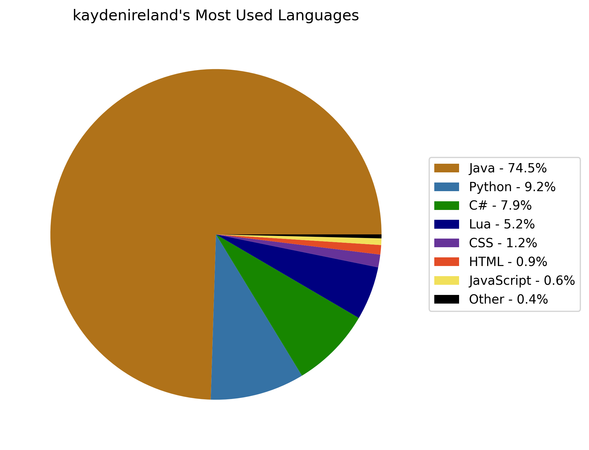
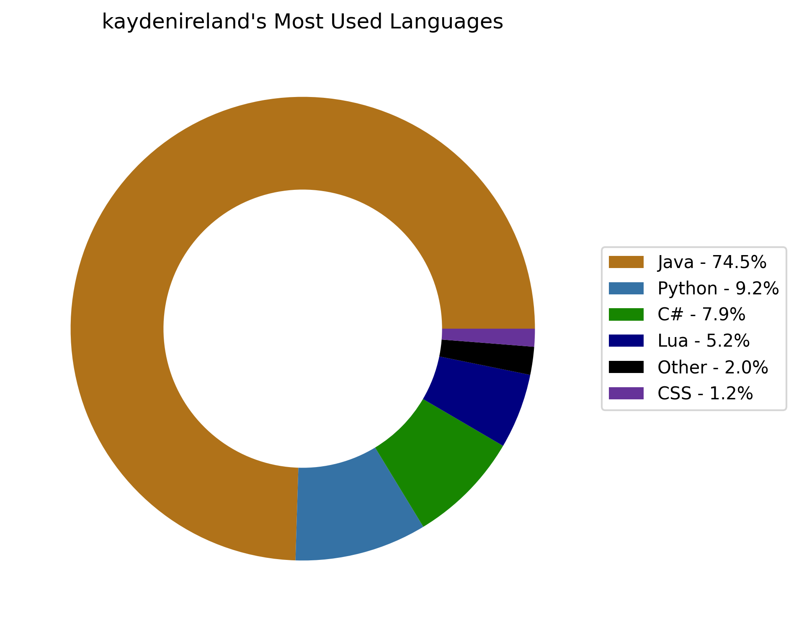
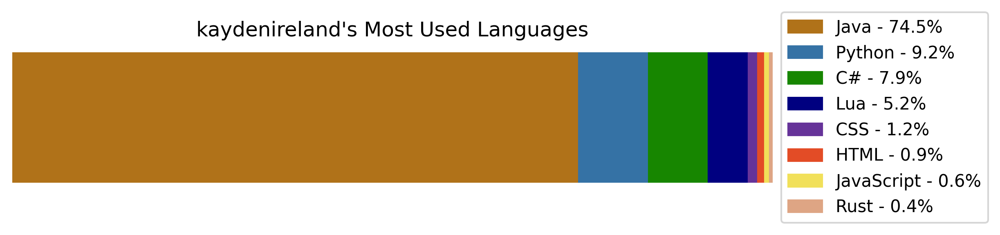
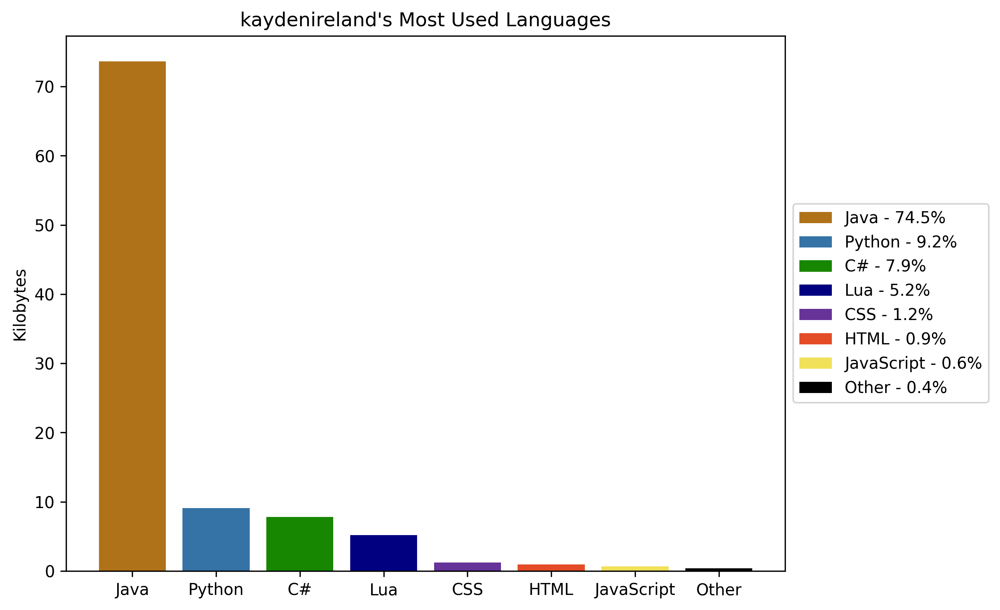
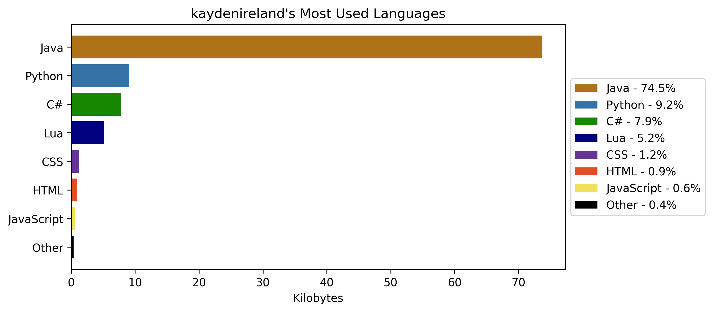

# Github Top Language Tool

Made for anyone who uses Github.  This tool allows the lookup of a user and his top languages used in repos.  This data can be exported to a json file or as a graph.

## Settings Usage

Examples with these settings can be found below or in the examples folder.

#

- Creates a donut graph using new data fetched from Github.  Any languages under 1% of total use is grouped into the other category.  Saves to a png.

```json
{
  "username": "kaydenireland",
  "token": "",

  "minimum_percentage": 0.01,

  "use_data": "new",
  "json_save_path": "output.json",

  "chart_type": "donut",
  "donut_hole_width": 0.3,


  "output_option": "save",
  "image_save_path": "chart.png",

  "theme": "default"
}
```

 
#

- Creates a stacked horizontal bar graph using saved data from the json file.  No languages are lumped into the other category and all are represented.

```json

{
  "username": "kaydenireland",
  "token": "",

  "minimum_percentage": 0.0,

  "use_data": "old",
  "json_save_path": "output.json",

  "chart_type": "stacked",
  "donut_hole_width": 0.3,


  "output_option": "save",
  "image_save_path": "chart.png",

  "theme": "default"
}

```


## Screenshots

Pie Chart 



#
Donut Chart



#
Stacked



#
Vertical Bars



#
Horizontal Bars




## Contributing

Contributions and suggestions always welcome!

Made by Kayden Ireland

